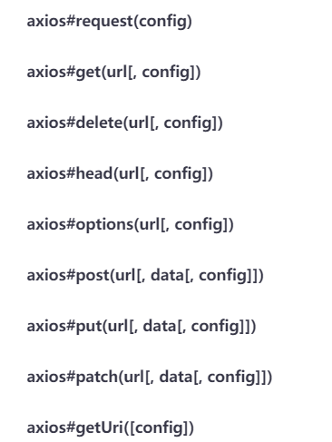

# Axios

[请求配置 | Axios 中文文档 | Axios 中文网 (axios-http.cn)](https://www.axios-http.cn/docs/req_config)

### 三种形式

注意点:后台设置了跨域,但是post还是报了跨域问题,前台设置

**headers:{'Content-Type': 'application/x-www-form-urlencoded'}**

#### 通用

axios({config}})

```js
 axios({
        url:"/axios-post",
        method:"post",
        data:{
          name:"lc",
          age:21
        },
        headers:{'Content-Type': 'application/x-www-form-urlencoded'}
      })
    }).then((response)=>{
console.log(response)
    }).catch((error)=>{
      console.log(error)
    })
```



#### get

axios.get("url",{配置}})

#### post

axios.post("url",{请求体}, {配置} )

```js
but[0].addEventListener("click", () => {
      axios.get("/axios-get", {
        params: {
          ID: 12345
        }
      }).then((response) => {
        console.log(response)
      }).catch(function (error) {
        // 处理错误情况
        console.log(error);
      })
    })

    but[1].addEventListener("click", function () {
      axios.post("/axios-post", {
          name: "lc",
          age: 21,
        },{
          params: {
            a: 123
          },
          responseType: 'json',
          headers: {  'Content-Type': 'application/x-www-form-urlencoded' },
        }
      ).then((response) => {
        console.log(response)
      }).catch((err)=>{
	console.log(err)
	}})
    })
```
